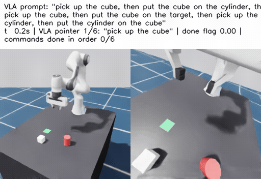
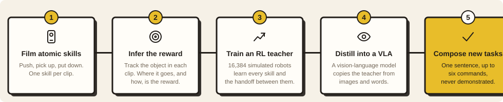
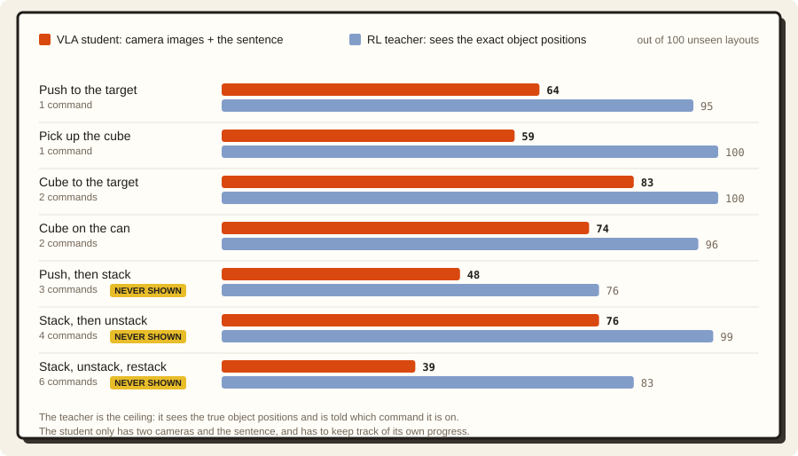
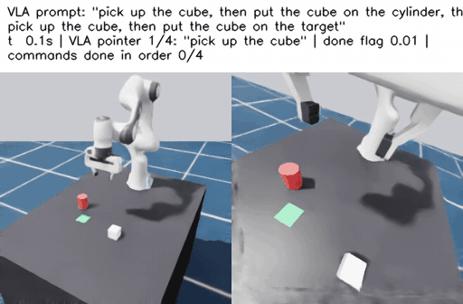
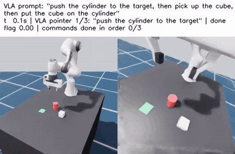
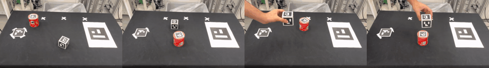
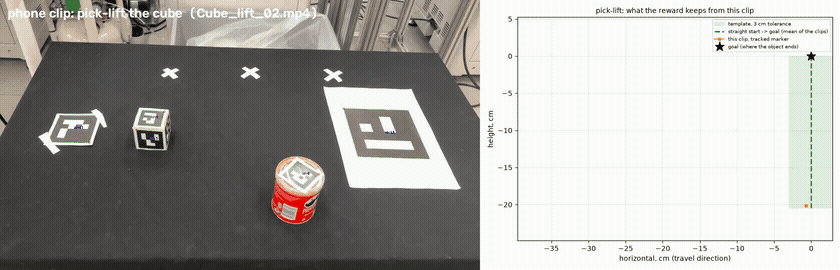
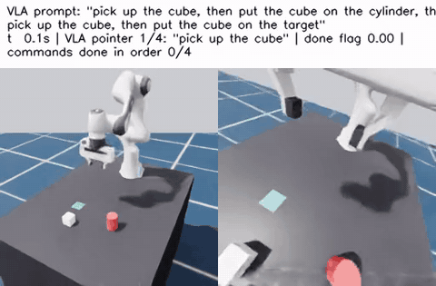
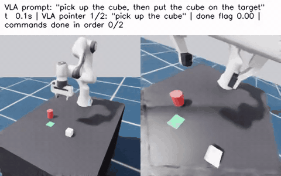
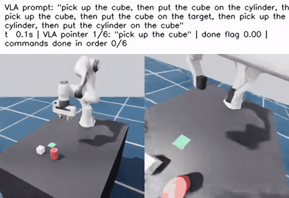

<p align="center">
  
</p>

<h1 align="center">I Never Showed It the Task</h1>

<p align="center">
  <b>Phone Clips of Single Skills&nbsp;&nbsp;|&nbsp;&nbsp;Object-Only Reward&nbsp;&nbsp;|&nbsp;&nbsp;One Sentence, Up to Six Commands&nbsp;&nbsp;|&nbsp;&nbsp;Its Own "(done)" Marks</b>
</p>

<p align="center">
  
</p>

<p align="center">
  <b>A 450M vision-language-action model gets one sentence with up to six commands and works through it using only camera images.<br>It never saw these tasks demonstrated. The only demonstrations were phone clips of me doing single skills.</b>
</p>

<p align="center">
  
  
  
  
</p>

<p align="center">
  <a href="https://theundercover01.github.io/ayushdeshmukh/projects/never-shown/"><b>Project page (all videos)</b></a> · <a href="#results">Results</a> · <a href="#the-idea-in-five-steps">How it works</a> · <a href="#the-memory-problem">Memory</a> · <a href="#what-didnt-work">What didn't work</a> · <a href="#reproduce-it">Run it</a> · <a href="PROGRESS.md">Full log</a>
</p>

> [!IMPORTANT]
> ### The videos are on the project page
> **[theundercover01.github.io/ayushdeshmukh/projects/never-shown](https://theundercover01.github.io/ayushdeshmukh/projects/never-shown/)** has the same story with all the videos playing inline: the phone clips, the six-command run and the failures. This README covers the same ground, plus pointers into the code and the commands to reproduce it. The GIFs here are shortened copies of the page's videos.

The policy gets a sentence like this one, once, at the start:

```
> pick up the cube, then put the cube on the cylinder, then pick up the cube,
  then put the cube on the target, then pick up the cylinder, then put the cylinder on the cube
```

Nobody demonstrated this task, there's no planner splitting up the sentence, and the simulator doesn't tell the policy which command it's on. The policy keeps track itself: when it thinks a command is done, it writes **"(done)"** after that command in the sentence it reads next.

> **TL;DR** I filmed myself on my phone doing **single skills**: pushing an object, picking it up, putting it down. Never two in a row. I turned those clips into a **reward**, trained an **RL teacher** with it in simulation, and then **distilled** the teacher into a vision-language-action model. That model gets one sentence with up to six commands and works through them using only camera images. It manages tasks of **3, 4 and 6 steps**, even though every training episode had only one or two commands.

## The idea in five steps

<p align="center">
  
</p>

## Results

Each task is tried on **100 table layouts** the model never trained on. A run counts as a success when the final arrangement the sentence asks for is reached and holds for half a second (**lenient**). The model was trained on episodes of **at most two commands**; everything marked **never shown** is longer than anything it saw. These numbers are from the final model, which I trained in two rounds: first on 4,500 episodes, then for 8,000 more steps on 1,800 freshly recorded ones. The unstack GIF is from the final model; the six-command GIF, the failure GIFs and the perturbation and marks tests further down were made with the first model, before that last step.

| | | |
| :---: | :---: | :---: |
| **76%** | **39%** | **0 → 60%** |
| of 4-step *stack, then unstack to the target* runs finished; never shown | of 6-step *stack, unstack, restack* runs finished; never shown | on the 4-step task when the model's own "(done)" marks are switched on (earlier checkpoint) |

<p align="center">
  
</p>

| Task | Commands | Never shown? | **Student: whole sentence + own "(done)" marks** (ours) | RL teacher (privileged state) |
| :--- | :---: | :---: | ---: | ---: |
| push the object to the target | 1 | | 64 | 95 |
| pick up the cube | 1 | | 59 | 100 |
| cube to the target (c1) | 2 | | 83 / 81 | 100 |
| cube on the cylinder (c2) | 2 | | 74 / 74 | 96 |
| push the cylinder to the target, then stack the cube on it (c3) | 3 | **yes** | 48 / 9 | 76 / 18 |
| stack, then unstack to the target (unstack) | 4 | **yes** | 76 / 35 | 99 / 94 |
| stack, unstack, stack the other way (restack) | 6 | **yes** | 39 / **15** | 83 / 83 |

<sub>Cells: lenient / in order, out of 100 (one number = lenient). **In order** = every command's result held, one after the other. Final model (`ours_cyl_marks_realref`); before the last 8K-step fine-tune the same recipe scored c3 40 / 3, unstack 60 / 29, restack 31 / 13.</sub>

<p align="center">
  
  
</p>

<p align="center"><sub>Left: <b>stack, then unstack to the target</b> (4 commands, never shown, 2×). Right: <b>push the can to the target, then stack the cube on it</b> (3 commands, never shown, 2×). More on the <a href="https://theundercover01.github.io/ayushdeshmukh/projects/never-shown/">project page</a>.</sub></p>

> [!NOTE]
> **For comparison.** A student trained on the same data but given **one command at a time** (an outside pointer moves on whenever the policy's done flag fires) gets 90 on the 4-step task, against 76 with the whole sentence. That's roughly what this student could do if it always knew which command it was on.

## Why this way?

There are more obvious ways to get a robot to "stack, then unstack, then restack". These are the ones people usually ask about, and why I didn't go with them.

**"Why not just fine-tune a VLA on the clips?"** You can't show it every task, and a VLA doesn't learn to combine skills just because each skill is somewhere in its data. When I trained SmolVLA directly on single-skill demonstrations, it learned a bit of pushing (16 of 100), no picking up, and got **0 on every combined task**. That's the part I wanted to solve. If it has seen what a lift looks like and what a put-down looks like, it should be able to work out how to do one after the other, in whatever order the sentence asks for.

**"And why not copy my hand from the clips?"** My hand and a two-finger gripper grab things in completely different ways, so copying my hand would teach the robot the wrong motion. The clips don't contain any gripper commands either. What they do show is what happens to the *object*: where it goes, how high, and in which direction. I wanted the robot to figure out how to make that happen with its own gripper, which is what RL is good at.

**"Then why not record robot demonstrations of the long tasks?"** That's the cost I wanted to avoid. Even with two objects, a target and three skills, there are a lot of possible 4- and 6-step tasks, and each new combination would need its own teleoperated demos. I wanted to film each skill once on my phone and get the combinations without demonstrating any of them.

**"Why not hand-write a reward for each task?"** I tried that first, and the policy found a way around every one: it sat on the gripper's release threshold, and later pushed things instead of lifting them. A reward built from the clips only describes what the object should do (where it goes, how high, in which direction). It doesn't matter how the robot holds the object, and the same reward works for any combination of skills.

**"Why train an RL teacher first, instead of the VLA directly?"** RL directly on a 450M-parameter model that looks at images would be very slow and need a huge number of tries. A small teacher that gets the exact object positions learns every skill in about an hour, running 16,384 simulated scenes in parallel. Then I distill it into a model that only uses cameras and the sentence. That way the teacher does the trial and error, and the VLA just has to copy it.

**"Why give the whole sentence, instead of a planner feeding one command at a time?"** That would work, and it actually scores higher here (90 vs 76 on the 4-step task). But then the hardest part, knowing when a step is really finished and what comes next, lives in hand-written code outside the model. I wanted the model itself to read the whole instruction and keep track of where it is. Writing "(done)" marks into the sentence was the simplest way I found to do that.

## 1 · Film atomic skills

The only demonstrations in this project are short phone clips of me doing one skill at a time with a real cube and a crisps can. **43 clips** were usable (46 approved): 12 pushes, 10 pick-ups and 21 put-downs (on the target, on the table, or on the other object). I never filmed two skills in a row, and none of the clips shows any of the tasks in the results.

<p align="center">
  
</p>

<p align="center"><sub>Left to right: push · pick up · put down · put on the other object.</sub></p>

| Data | Count | Used for |
| :--- | ---: | :--- |
| Phone clips: push | 12 | Object path → reward |
| Phone clips: pick and lift | 10 | Object path → reward |
| Phone clips: place down | 21 | Object path → reward |
| Teacher episodes with **two or fewer** commands | 3000 paired + 1500 push (+ 1200 paired + 600 push re-recorded for the last fine-tune) | VLA training data |
| Episodes with **3, 4 or 6** commands | 0 | Evaluation only |

> [!TIP]
> **Why I track the object and not my hand.** Copying my hand would teach the robot a motion it can't really do with a two-finger gripper. What does transfer is what happens to the *object*: where it starts, where it ends up and the path in between. So I stuck an ArUco marker on each object and on the target (cube ids 1–5, can lid 0, target 11), which gives me each object's position and orientation on the table in every frame. One more marker (13) is only there for calibration, to get the table plane and the scale.

## 2 · Infer the reward from the clips

<p align="center">
  
</p>

<p align="center"><sub><b>From a phone clip to a reward.</b> The tracked markers give the object's path on the table. All clips of one skill together become a template the simulated object has to follow. The hand is never scored.</sub></p>

The reward only cares about the **object**. It doesn't score the robot's hand or gripper at all. I track eight points on the object, and they have to follow the skill's template from where the object starts to where the command wants it. The robot gets rewarded for progress along the template, and a command counts as finished once the object reaches its goal and stays there. These parts come from the clips:

- **Where the object goes:** lift height (20 cm), drop height and push direction, averaged over the clips of each skill.
- **How precisely:** the template's tolerance is 3 cm, which is how much my own clips wander around the average path (median deviation 2.6–3.2 cm).
- **How far a skill may turn the object:** push turns it a little, lift and put-down don't, measured from the clips.

Some things can't be read off a clip, like how close is close enough, how still is still, or how big the reward should be. I set those by hand: an object counts as finished when it's within 2 cm of its goal and moving slower than 0.1 m/s for 0.3 s, there's a small cost per step, a bonus for each finished command, and a small bonus for holding the object still at the goal. The starting poses for part of the training are scripted as well, because the clips don't track my hand.

> [!WARNING]
> **Every reward that involved the gripper got gamed.** My first rewards paid for grasping and carrying. The policy figured out it could sit right on the release threshold and open and close the fingers every other step, collecting both the "holding" and the "released" reward without ever finishing (0 of 100). When I changed it to pay for "the object is near the goal" whether it was held or not, it just *pushed* the cube onto the target instead of lifting it. That's why the final reward follows the object's path and nothing else: pushing can't get the cube 20 cm up in the air.

> [!WARNING]
> **The cube went up and never settled.** With only the path reward, the policy carried the cube along the whole lift path and then kept moving it around in the air, so "pick up" never counted as done. I fixed it with a small reward for holding the object still at the goal, and a "finished" check that needs the object to stay at rest for a few steps.

> [!WARNING]
> **At the start, an object-only reward gives the arm nothing to go on.** Nothing in the reward changes until the gripper happens to touch the object. A run that always started from the robot's home pose learned **nothing in 504 iterations**. To get around it, I started some of the training episodes in the middle of a skill, with the hand already at the object, so the reward kicks in early.

## 3 · Train an RL teacher

The teacher is a Franka Panda in Isaac Lab, trained with PPO on **16,384 parallel scenes** for 400 iterations. It gets privileged information: the exact position of both objects, the next point on the template, and which command it's on. Every training episode has **one or two commands**, which is enough to learn each skill and the hand-over from one skill to the next. When the reward's "finished" check passes, the episode moves on to the next command.

Since it's told which command it's on, the teacher can chain as many as you give it. On random chains of **20 commands** it still finishes 90 of 100 (83 in order). So length on its own isn't the problem. The hard part is doing a long task without anyone telling you where you are, and that's what the student has to do.

> [!TIP]
> **Why the teacher learns handoffs, not whole sequences.** The teacher never trains on a whole long task. Each episode is one skill, or two back to back, and the second one starts from wherever the first left the object and the arm. What it learns is the *handoff*: finish a skill, notice that it's finished, and start the next one from exactly that state. The VLA picks this up from the teacher. It doesn't memorise "stack, then unstack, then restack" as one long motion. It learns the skills and how to switch between them, and the sentence decides the order. A 6-step task is then just five handoffs in a row, each of a kind it has seen in training.

> [!WARNING]
> **My first teachers were good, but impossible to copy.** PPO learned "bang-bang" control: 30–55% of its actions sat right at the limits and flipped sign from one step to the next. A VLA trained on those actions fit them **no better than just predicting the average action**, and scored 0 on almost every task. Adding a penalty for changing actions barely smoothed them out.

> [!TIP]
> **The fix: a low-pass filter on the teacher's arm.** The arm executes a running average of the teacher's commands (95% the previous one, 5% the new one), and the student learns from the motion the arm actually made. So the teacher learns to drive a smooth arm, and the student gets smooth labels. Each time I made the teacher smoother, the student got better: going from a 0.7 to a 0.85 filter took pick-up from 51 to 63, and the 2-step tasks went up to 44–49. The final teacher uses 0.95.

## 4 · Distill into a vision-language-action model

I record the teacher with cameras on and train **SmolVLA** (450M parameters) to copy it, using only a front camera, a wrist camera and the sentence. It doesn't get object positions or a command counter.

> [!TIP]
> **Every scene is recorded twice.** I record each layout once with "the cube" in the sentence and once with "the cylinder". The images are the same, so the model can only tell which object to move by reading the sentence. Before I did this, it mostly went for whichever object was easier. In an earlier two-cube version, this took picking up the right object from 45 to 80.

## The memory problem

To do a long task you need three things: the **skills**, the **handoffs** between them, and knowing **where you are** in the list. The teacher learns the first two and the student copies them. The third is what makes long tasks hard, and the teacher never had to deal with it, because the simulator just tells it which command is current. The student only has two cameras and the sentence.

And the images don't tell you where you are. Take the 6-step task: *pick up the cube, put it on the cylinder, pick it up again, put it on the target, pick up the cylinder, put it on the cube.* The arm reaches for the cube in step 1 and again in step 3, and the two scenes look almost the same. The same arrangement shows up more than once along the way, so often you can't tell from one picture which command you're on. The model needs some kind of **memory**. This is what I tried, in order:

| # | Memory | Result | Why |
| :---: | :--- | :--- | :--- |
| 1 ✗ | **Nothing: just the whole sentence.** The model reads the full instruction every step and has to infer progress from the image. | 4-step task: 14 of 100, in the right order just once (earlier two-cube version) | With no memory it loses its place, because the picture doesn't say which step it's on. |
| 2 ✗ | **Show it the past.** An extra camera frame from a few seconds earlier, then past actions and hand motion as inputs. | It didn't help | A frame from the past doesn't say which command that was either. |
| 3 ~ | **An outside pointer, one command at a time.** The model gets only the current command, plus a "done" output. When it says done, an outside script moves to the next command. | 4-step task: 90 of 100 | It works, but then the memory is in a script and not in the model. |
| 4 ~ | **A counter in the input.** Back to the whole sentence, plus "k commands done" as a number the model reads. Its own done output raises k. | 4-step: 75 of 100 · 6-step: 5 | So memory helps a lot. But the 6th position never came up in training, so the 6-step task fell apart. |
| 5 ✓ | **"(done)" marks in the sentence itself.** Same done output, but instead of a number it writes "(done)" after the finished command, in the words the model already reads. Sentences are padded so every position comes up in training. | 6-step: 31 (counter: 20) · push 44 (counter: 34) | It turns out a language model is much better at noticing which words are marked done than at using a single number. Its done signal was also right a lot more often: 59–72% of the time, against 28–31% for the counter. |

So the "(done)" marks are the model's memory, and the model writes them itself. Halfway through the 4-step task, the sentence it reads looks like this:

> ~~pick up the cube~~ **(done)**, then ~~put the cube on the cylinder~~ **(done)**, then **`pick up the cube`** ← *now*, then put the cube on the target

1. **Where the label comes from.** From the teacher's handoffs. In training, the model's extra "this command is done" output (a 6th action channel) is 1 for the last 5 frames, half a second, before the teacher switched to its next command, and 0 otherwise. So the model learns to spot the moment a handoff should happen.
2. **How a mark is written.** When that output stays above 0.85 for five steps in a row, "(done)" goes after the current command.
3. **How it's used.** On the next step the model reads the sentence with the mark in it, and the first command without a mark is the one to do.

> [!TIP]
> **Training on two commands, but padding the sentence to twenty.** Training episodes only ever have one or two real commands, but I pad the sentence with up to 18 extra commands, some of them already marked done. That way the model sees the current command at every position in a long sentence, which is exactly what broke the counter. It did cost something: with the same training budget, the short tasks got worse (cube on the can went from 75 to 42).

**Does the model actually use its marks?** I tested the first model (before the last fine-tune) in three ways:

- **Marks switched off** (the sentence never changes): the 4-step task finishes **0 times in 50**.
- **Its own marks:** **60 in 100** (76 for the final model).
- **The first two commands marked done in advance:** it believes the marks, skips straight to command three and finishes **42 times in 50**.

<p align="center">
  
  
</p>

<p align="center"><sub>Left: <b>marks switched off (3×)</b>. The sentence never changes, so the model keeps acting on command one. Right: <b>its own marks (3×)</b>. Each "(done)" moves it on to the next command, all six in order.</sub></p>

> [!CAUTION]
> **The part I haven't solved: it marks things done too early.** The weak spot is the done signal. If it fires before a step is really finished, every step after that is on the wrong command. I tried three fixes and none of them really worked. A stricter threshold (0.9 for 8 steps) helped the 4-step task but hurt the tasks with the cylinder. Voting over three samples was no better. Asking the model to double-check its last mark did catch the wrong ones (93–100% of the marks it took back really weren't done), but it didn't then redo the step, and long chains got worse. For now, letting the model keep its own place costs about 14 points on the 4-step task (90 with the outside pointer, 76 without).

## Poking at it

I also messed with the first model a bit, without retraining it (`sim/eval_chains.py --perturb`, `scripts/perturb_study.sh`, 50 layouts per row, videos in `media/perturb/`). "Redone" = the sentence's end result was reached again (held 0.5 s) after the disturbance.

| Test | What is done to it | Result |
| :--- | :--- | :--- |
| **No marks** (ablation) | The done flag is ignored, the sentence never changes | unstack **0 / 50** (0.72 of 4 commands) |
| **Pre-written marks** | Unstack starts with the cube on the table and the first two commands already marked "(done)" | **42 / 50** finish (3.68 of 4 in order): it skips to command 3 |
| **Oracle marks** (ablation) | The simulator's check writes the marks instead of the policy's flag | unstack in order **31 / 50** (own flag: 29 / 100); restack 10 / 50 (own: 13 / 100) |
| Knock | The finished cube is thrown to a free spot, its marks untouched | 16 of 30 redone (median 11.5 s) |
| Knock + erase 2 marks | Same, and the last two "(done)" marks are erased at that moment | 14 of 29 redone (10.6 s) |
| Knock a stack + erase 2 marks (c2) | The cube is thrown off the cylinder | 5 of 29 redone |
| Drop | The cube is taken out of the gripper after "pick up" is marked | 10 of 36 redone |
| Drop + un-mark "pick up" | Same, "pick up" un-marked | 9 of 32 redone |
| Move | The cube is moved to a new spot while the arm reaches for it | 12 / 50 (undisturbed: 63 / 100) |

<p align="center">
  
</p>

<p align="center"><sub><b>Knocked away after it was done (2×).</b> Both commands are marked done, yet it goes back for the cube.</sub></p>

- **The marks are the memory, and the policy reads them.** Without them the 4-command chain never finishes (0 / 50). With two marks written in advance it starts at the right command (42 / 50).
- **On 4 commands about half of the loss is the memory; on 6 it is the skill.** Perfect marks double unstack in order (29 → 62%) but barely move restack (13 → 20%): there the commands fail even with the right mark (stacking the cylinder on the cube is 41% on its own).
- **When it recovers after the task is done, it's going by the image, not the text.** A thrown-away cube is fetched back about half the time whether or not its marks are erased (16 / 30 vs 14 / 29), even though the sentence says everything is done. It never saw a knock in training, so this isn't a learned recovery. The policy is just reacting to the cube not being on the target in the image.
- **Weak spots:** re-targeting an object that moves during the reach (12 / 50), rebuilding a stack (5 / 29), and the done flag firing early. In the drop test some drops happened with both commands already marked done while the cube was still in the air.

## What still goes wrong

<p align="center">
  
</p>

<p align="center"><sub><b>A failed 6-step run (3×).</b> Three of the six commands get done in order, then it falls apart.</sub></p>

- **The done signal fires too early.** One early mark puts every later step on the wrong command, so the longer the task, the worse it gets. A stricter threshold helps some tasks and hurts others, and double-checking finds the wrong marks but doesn't fix the steps.
- **The basic tasks succeed 59–83% of the time** (push 64, pick-up 59, cube on can 74, cube to target 83), against 95–100% for the teacher, and over six steps in a row those misses add up.
- **The 6-step task is the hardest:** 39 of 100 finish, and only 15 do all six steps in the right order.

## What didn't work

A lot of things didn't work before this did. These are the main ones. The early videos on the [project page](https://theundercover01.github.io/ayushdeshmukh/projects/never-shown/) are from the first version of the setup (two cubes, a different table).

| | Attempt | What happened | Numbers |
| :---: | :--- | :--- | :--- |
| ✗ | **Fine-tune the VLA on single skills** | I trained SmolVLA directly on single-skill demonstrations to see if it would combine them. It didn't. | push 16 · pick-up 0 · every combined task 0 |
| ✗ | **Clean scripted demonstrations** | The model fit the perfect demos well, but it had never seen a mistake, so it couldn't recover from its own. | 6 of 100 on the 2-step task |
| ✗ | **A reward for grasping and carrying** | The policy sat on the release threshold and opened and closed the fingers to collect both terms. | 0 of 100, while "placing" 99.6% of the time in training |
| ✗ | **A reward for distance to the goal** | Pushing the cube onto the target was the cheap way to get closer, so it stopped lifting. | 19 of 100 when a real lift was required |
| ✗ | **A vocabulary of motion primitives** | RL over learned 2-second skills preferred pushing even more than RL on raw actions. | ~75% of successes were pushes (raw actions ~50%) |
| ✗ | **Starting every episode at home** | With an object-only reward nothing changes until the gripper touches the object by chance. | nothing learned in 504 iterations |
| ✗ | **A loose "hand has arrived" check** | The hand stopped above the cube's centre, the fingers closed on the top edge and the cube slipped. | best lift 1.6 cm (the clips lift 14 cm) |
| ✗ | **Imitating raw RL actions** | Bang-bang actions flip sign every step. The VLA fit them no better than predicting the average. | 0 on every task but push (14) |
| ✗ | **Penalising action changes** | A cost on changing actions kept the skills but barely smoothed the teacher. | still too jittery to imitate |
| ✗ | **Smoothing the labels afterwards** | Averaging the teacher's actions over half a second lowered the loss but didn't fix the fit. | loss 0.93 → 0.77, still near the average |
| ✗ | **A camera history and a trained vision encoder** | More inputs (an older frame, past actions, a closer camera, unfreezing vision) did not help the student. | worse than the plain student |
| ✗ | **Fixing the done flag by thresholds / voting** | A stricter flag helps unstack but hurts the cylinder chains. Voting three samples is no better. | never completes 8 commands |
| ✗ | **Self-check** | The VLA finds its wrong marks, but does not redo the command. | 93–100% of erased marks really not done; random 8-chains in order 2.5 → 1.0 |
| ✗ | **Rest speed and hold time measured from the clips** (instead of the hand-set 0.1 m/s, 0.3 s) | The teacher trained well (97.7% of training episodes done) but scored push 14 / 50 in the evaluation, against 95 / 100 for the hand-set version. Probably its 0.2 s hold is shorter than the evaluation's 0.5 s (not verified). The student from it (from scratch, 14K steps) scored below every other student. | student: unstack 17 / 50, restack 7 / 50, push 9 / 50 |
| ✗ | **Padding the sentence to 20 commands** for the same training budget | Every position comes up, but the short tasks pay for it. | c2 75 → 42, lift 77 → 51 |

What did work, with the numbers:

| | Finding | Numbers |
| :---: | :--- | :--- |
| ✓ | **A reward built from object paths only.** The teacher learns every skill from it and can chain them. Its success barely drops with length, so when the student gets worse on longer tasks, that's down to the student. | Random chains of 4–20 commands: 44–48 of 50 in order |
| ✓ | **Paired counterfactual episodes** fixed which object the policy acts on. | Earlier red/blue students: lift 45 → 80 |
| ✓ | **Imitating the filtered, executed action**, not the raw RL action. | Raw bang-bang PPO actions: fit no better than the mean |
| ✓ | **The policy's own done flag as memory.** | Flag ignored: unstack 0 / 50. Flag writes marks: 60 lenient, 29 in order (first model) |
| ✓ | **Marks in the text beat a number in the state.** Same data, same budget. | Restack in order 13 vs 0, unstack 29 vs 4, push 44 vs 34 |
| ✓ | **More push data.** | Push 23 → 44 when push frames went 12% → 27% |

<details>
<summary>Earlier attempts, kept in the log</summary>

See [PROGRESS.md](PROGRESS.md):

- A motion-vocabulary action space (skill + VAE latent).
- Fine-tuning SmolVLA directly on replayed clips (B1, on scripted stand-in clips): push 16, lift 0, combined tasks 0.
- A hand-shaped reward that lifted by pushing.
- An object-only reward with no starting poses, which learned nothing in 504 iterations.

</details>

## What I'd do differently

- **Drop the mid-skill starts.** This is the main weakness of the current setup. Because the reward only looks at the object, a fresh agent gets no signal until it touches the object by chance, so the teacher behind these results starts part of its episodes in the middle of a skill to ease training. There is a cleaner way, and it doesn't need hand tracking: the RL agent already knows where its gripper is. So the reward can be one chain of three points, **gripper → object → target**, each leg a straight template like the object's. I tested this in a later version with more objects, and it worked: from the home pose alone it learned to push within 40 iterations, where the object-only reward had learned nothing in 500, and it went on to pick and place every object. It came too late to finish the evaluations, so all results here are from the teacher with mid-skill starts.
- **More memory, up to 20 commands.** The teacher already does random 20-command chains (90 of 100), so the limit is the student's memory. One concrete gap: in training, the sentence is padded with up to 18 extra commands *before* the real ones, but only 0–3 *after* them. So the model has never seen a long list of commands still to come, and that's exactly what the early part of a 20-command task looks like. My guess is that padding both sides evenly up to 20, plus a more reliable done signal, would get it from 6 commands to 20.
- **Close the gap to the teacher.** The basic tasks are 59–83% for the student against 95–100% for the teacher. More data and longer training would help, and so would RL fine-tuning of the VLA itself, starting from the distilled model.
- **A separate "is it done?" check.** A small model that only judges whether a command is finished could write the marks more reliably than one output of the action model.
- **Run it on a real robot.** Everything here is in simulation. The clips are real, but the robot so far isn't.

## Reproduce it

| Step | What happens | Code |
| :--- | :--- | :--- |
| **1. Clips → reward** | 46 approved clips (43 trackable). ArUco markers on the cube (ids 1–5) and the can lid (0); the target (11) and a calibration marker (13) define the table plane. Only the object's start and end are kept: a straight line from the clips' mean start offset to the goal, 3 cm tolerance. Lift height (20.4 cm), drop height, push direction and end turn come from the clips. | `handtrack/`, `motion/keypoint_ref.py`, `analysis/clip_video.py` |
| **2. Teacher** | PPO on the object-keypoint reward (8 corners of the object follow the template), a hold-still bonus once the goal is reached, and an action low-pass of 0.95 so the actions are smooth enough to imitate. | `sim/envs/keypoint_env.py`, `sim/train_rl.py`, `scripts/train_teacher.sh` |
| **3. Distillation** | 3000 paired episodes (the same scene recorded once per object, so the policy must read the object's name) + 1500 extra push episodes. SmolVLA from `smolvla_base`, early-stopped at 34K steps; then 8K steps on 1200 paired + 600 push episodes re-recorded with the real-clip template (`ours_cyl_marks_realref`). | `sim/record_keypoint_rollouts.py`, `vla/build_dataset.py --prompt_mode marks --pad even --max_cmds 20`, `scripts/distill_place.sh`, `scripts/finetune_real_ref.sh` |
| **4. Evaluation** | The sentence is given once. The only thing that moves the policy's place is its own done flag. | `sim/eval_chains.py --learned_done --marks --whole_prompt` |

Environments: Isaac Lab 2.3.2 / Isaac Sim 5.1 (`isaaclab`), LeRobot 0.6.2 (`lerobot`), OpenCV with ArUco (tracking).

```bash
# clips -> template
python -m handtrack.cut_session ...; python -m handtrack.track_objects <clip>
python -m handtrack.make_clips <root> --calib ... --out data/processed/clips_real
python -m motion.keypoint_ref --clips data/processed/clips_real --straight --out data/processed/keypoint_ref_real_straight.npz

# teacher, rollouts, student
scripts/train_teacher.sh
scripts/distill_cyl_fixed.sh   # records the 3000 paired episodes (and the one-command reference student)
scripts/record_push.sh         # 1500 push episodes
NAME=ours_cyl_marks MODE=marks GPU=0 MAXC=20 KN=20 TOK=192 DUP=0 \
  ROLL="data/processed/rollouts/ours_cyl_fixed_done data/processed/rollouts/push_extra" scripts/distill_place.sh
scripts/finetune_real_ref.sh   # the last 8K steps -> ours_cyl_marks_realref (the final model)

# studies
scripts/length_curve.sh; scripts/done_study.sh; scripts/eval_edits.sh; scripts/perturb_study.sh; scripts/headline_videos.sh
```

Results: [results/comparative/](results/comparative/) (tables, per-episode CSVs, loss and teacher curves). The full log with the cause of every number: [PROGRESS.md](PROGRESS.md).

## Prior work

Learning from Play (Lynch et al. 2019); SPiRL and residual skill policies; LAPA (2410.11758); expert-to-VLA distillation (Exp2VLA 2607.03146, VLA-OPD 2603.26666); RL for VLAs (SimpleVLA-RL 2509.09674); SmolVLA (LeRobot).

<p align="center"><sub>Ayush Deshmukh · <a href="https://theundercover01.github.io/ayushdeshmukh/projects/never-shown/">project page</a> · <a href="https://github.com/TheUndercover01/ayushdeshmukh">more side quests</a></sub></p>
